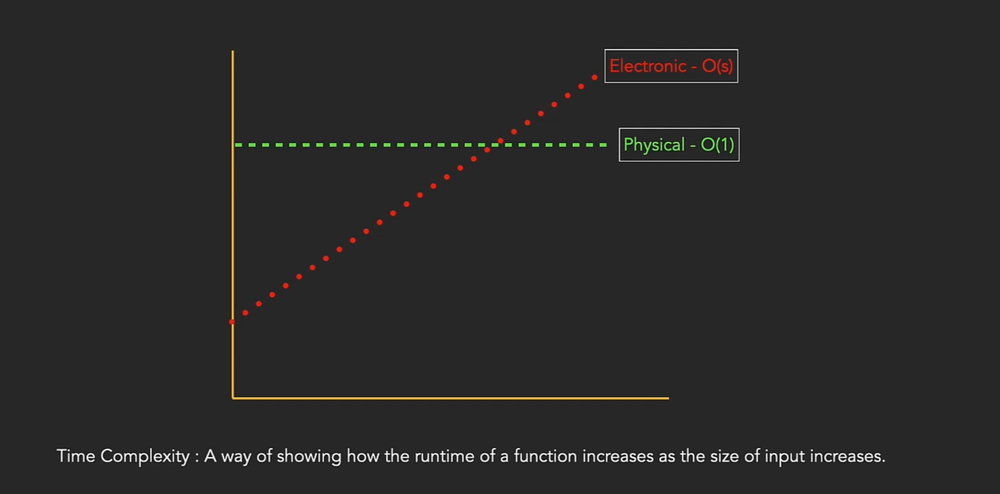

# DSA
- DSA [Data Structures And Algorithms]

## Data Structures
- Data structures are different ways of organizing the data on your computer, that can be used efficiently.
- Data structure types
  - Primitive: Fixed in size
    - Integer
    - Float
    - String
    - Boolean
  - Non-Primitive: 
    - Linear: Elements arranged in sequential order
      - List (Built-In)
      - Tuple (Built-In)
      - Array
      - LinkedList
      - Stack
      - Queue
    - Non-Linear: Elements are not arranged in sequential order
      - Set (Built-In)
      - Dictionary (Built-In)
      - Tree
      - Graph

## Algorithms
- Algorithms are a set of instructions that can be used to solve a problem.
- Algorithms are different ways of solving the problem, based on the data structure that you choose.
- Algo Types
  - Sorting: To sort data in ascending order, descending order, or any other order.
  - Searching: To find a specific value in data set
  - Graph: To work with the data that can be represented as a graph.
  - Dynamic Programming: To solve problems that can be broken down into smaller subproblems.
  - Divide and Conquer: To solve problems by dividing them into smaller subproblems. solving each sub problem independently and then combining the results.
  - Recursive: To solve problems by calling themselves.

## Time And Space Complexity
- Time Complexity: It is the amount of time taken by an algorithm to run as a function
  - The rate of increase in time taken by an algorithm to run as the input size increases.
- Space Complexity: It is the amount of memory taken by an algorithm to run as a function
  - Input Space: It is the space taken by the input to the algorithm.
  - Auxeiliary Space: It is the extra space or temporary space used by an algorithm to run.
  - Total Space: It is the sum of input space and auxiliary space.

## Big Notations
- [Worst case] Big O: It is a complexity that is going to be less or equal to the worst
- [Best Case] Big Omega: It is a complexity that is going to be greater or equal to the best
- [Average Case] Big Theta: It is a complexity that is going to be equal to the average case

## TLE - Time Limit Exceeded
- When the algorithm takes more time than the time limit set by the problem statement, it is called TLE.
- To avoid TLE, we need to optimize the algorithm to reduce the time complexity.
- We can optimize the algorithm by choosing the right data structure and algorithm for the problem.
- We can also optimize the algorithm by using techniques like memoization, dynamic programming, etc.
- We can also optimize the algorithm by reducing the input size or by using better algorithms.
- We can also optimize the algorithm by using better data structures like hash tables, heaps, etc.
- We can also optimize the algorithm by using better algorithms like binary search, quick sort, etc.
- Usually server will take 1 second to execute 10^8 operations.
- So, if the input size is 10^5, then the time complexity should be O(n log n) or O(n) to avoid TLE.

## Time complexity of python common operations

> https://wiki.python.org/moin/TimeComplexity

| Operation          | Time Complexity |
|--------------------|-----------------|
| Accessing an element in a list by index | O(1) |
| Appending an element to a list | O(1) |
| Inserting an element at the beginning of a list | O(n) |
| Inserting an element at the end of a list | O(1) |
| Inserting an element at a specific index in a list | O(n) |
| Deleting an element from a list by index | O(n) |
| Deleting an element from a list by value | O(n) |
| Searching for an element in a list | O(n) |
| Accessing an element in a dictionary by key | O(1) |
| Inserting an element in a dictionary | O(1) |
| Deleting an element from a dictionary by key | O(1) |
| Searching for an element in a dictionary by key | O(1) |
| Accessing an element in a set | O(1) |
| Inserting an element in a set | O(1) |
| Deleting an element from a set | O(1) |
| Searching for an element in a set | O(1) |

